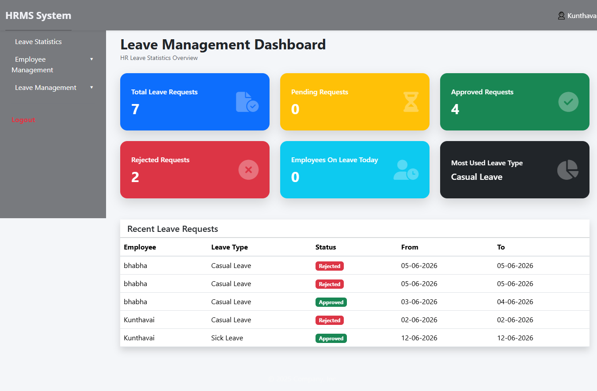
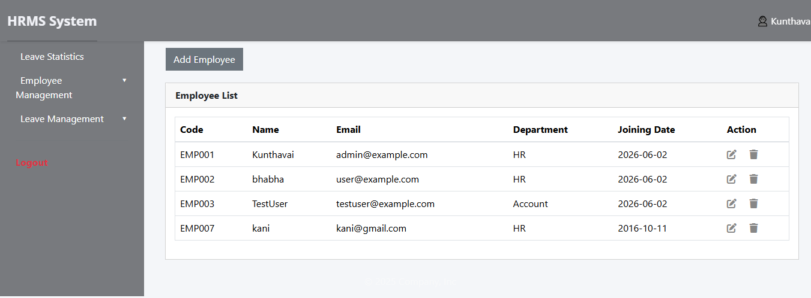
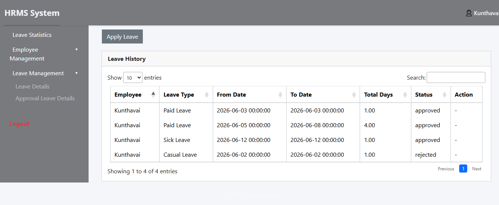
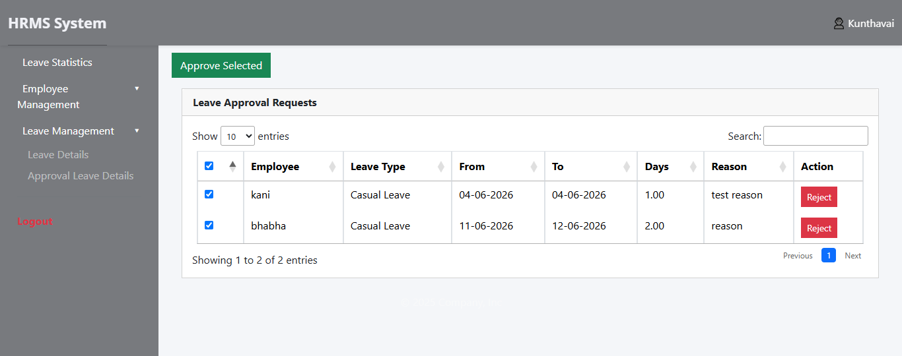
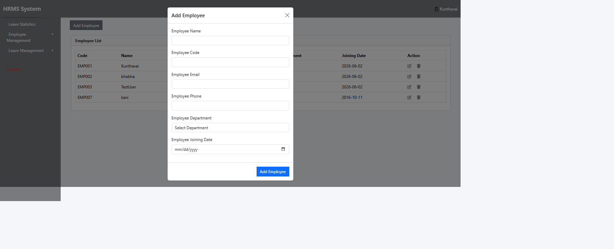

# HRMS Leave Management System

## Project Overview

A Human Resource Management System (HRMS) built using Laravel that provides employee management, role-based access control, leave management, leave approval workflows, leave balance tracking, and attendance dashboard statistics.

---

## Features

### Employee Management

* Add Employee
* Edit Employee
* Delete Employee
* Employee Listing
* Employee Code Validation

### Leave Management

* Apply Leave
* Leave Approval / Rejection
* Leave Balance Tracking
* Overlapping Leave Validation
* Sandwich Rule Implementation
* Leave History

### Role Based Access Control (RBAC)

* User Management
* Role Management
* Menu Permissions
* Dynamic Menu Access

### Dashboard

* Total Employees
* Present Employees
* Employees On Leave
* Attendance Summary

---

## Technology Stack

* Laravel 12
* PHP 8+
* MySQL
* Bootstrap
* jQuery
* Yajra DataTables
* Laravel Sanctum

---

## Database Design

### Tables

* users
* employees
* roles
* role_user
* menus
* role_menu
* leave_types
* leave_balances
* leaves

---

## Database Relationships

### User ↔ Role

Many-to-Many

```text
users
   ↕
role_user
   ↕
roles
```

### Role ↔ Menu

Many-to-Many

```text
roles
   ↕
role_menu
   ↕
menus
```

### User ↔ Leave

```text
User
  |
  | hasMany
  ↓
Leave
```

### Leave Type ↔ Leave

```text
LeaveType
    |
    | hasMany
    ↓
Leave
```

### User ↔ Leave Balance

```text
User
   |
   | hasMany
   ↓
LeaveBalance
```

---

## Screenshots

### Dashboard



### Employee Management



### Leave List



### Leave Approval



### Apply Leave


### Add Employee



---

## Installation

Clone repository:

```bash
git clone https://github.com/kunthavai/hrms-leave-management.git
```

Navigate to project:

```bash
cd hrms-leave-management
```

Install dependencies:

```bash
composer install
```

Copy environment file:

```bash
cp .env.example .env
```

Generate application key:

```bash
php artisan key:generate
```

---

## Database Setup

### Option 1 (Recommended)

Import the SQL file provided in:

```text
db_file/lms.sql
```

Create a database named:

```text
lms
```

Import:

```text
db_file/lms.sql
```

Update `.env`:

```env
DB_CONNECTION=mysql
DB_HOST=127.0.0.1
DB_PORT=3306
DB_DATABASE=lms
DB_USERNAME=root
DB_PASSWORD=
```

### Option 2

Run migrations:

```bash
php artisan migrate
```

Run seeders:

```bash
php artisan db:seed
```

---

## Run Application

```bash
php artisan serve
```

Application URL:

```text
http://127.0.0.1:8000
```

---

## Business Rules Implemented

### Overlapping Leave Validation

Employees cannot apply for leave on dates that overlap with existing leave records.

### Sandwich Rule

Implemented scenarios:

```text
AB - WO - AB
```

Weekend counted as leave.

```text
AB - WO - WO - AB
```

Both weekends counted as leave.

### Leave Balance Validation

Leave applications are validated against available leave balance before approval.

---

## Project Structure

```text
app/
├── Http/
├── Models/
├── Repositories/
├── Services/

database/
├── migrations/
├── seeders/

resources/
├── views/

routes/
├── web.php

db_file/
├── lms.sql

screenshots/
```

---

## GitHub Repository

Repository Link:

```text
https://github.com/kunthavai/hrms-leave-management
```

---

## Future Enhancements

* Attendance Management
* Payroll Module
* Email Notifications
* Holiday Management
* Multi-Level Leave Approval
* Employee Self-Service Portal
* Reporting Dashboard

---

## Author

Kunthavai PK
